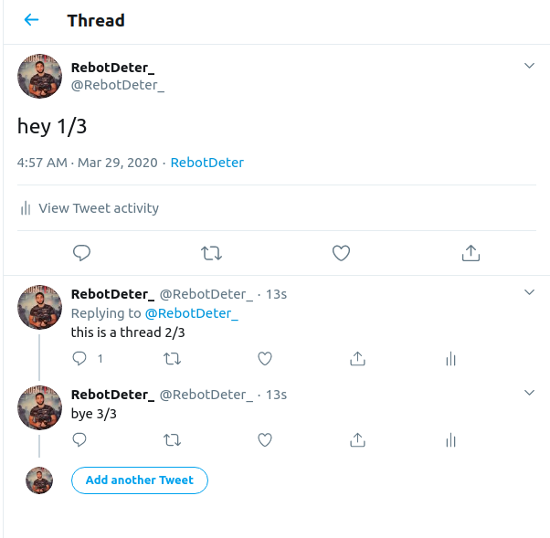

[![Build][build-shield]][build-url]
[![Issues][issues-shield]][issues-url]
[![MIT License][license-shield]][license-url]
[](https://coveralls.io/github/adblanc/twit-thread?branch=master)

<br />

  <h2 align="center">Twit Thread</h2>

  <p align="center">
    Twit Thread is a Node.js module written in Typescript that add utility functions to 
  <a href="https://github.com/ttezel/twit"><strong>Twit Twitter API Wrapper</strong></a>
  and help you implement threads in your twitter bot.
    <br />
    <br />
    ·
    <a href="https://github.com/adblanc/repo/issues">Report Bug</a>
    ·
    <a href="https://github.com/adblanc/repo/issues">Request Feature</a>
  </p>
</p>

## Table of Contents

- [About the Project](#about-the-project)
  - [Built With](#built-with)
- [Installation](#installation)
- [Usage](#usage)
- [Tests](#tests)
- [Contributing](#contributing)
- [License](#license)

## About The Project

This module allows you to tweet as a thread using Twit wrapper.
If any of the strings passed to the function tweetThread is greater than max characters allowed per tweet by twitter (**280 at the moment**), the function will truncate those and proceed making an ordered thread from those.

### Built With

- [Twit](https://github.com/ttezel/twit)
- [Typescript](https://github.com/microsoft/TypeScript)
- [Dotenv module](https://github.com/motdotla/dotenv)

## Installation

```sh
# with yarn
yarn add twit-thread

# or with npm
npm install twit-thread
```

## Usage

```js
const { TwitThread } = require("twit-thread");
// or import { TwitThread } from "twit-thread" in Typescript

const config = {
  consumer_key:         '...',
  consumer_secret:      '...',
  access_token:         '...',
  access_token_secret:  '...',
  timeout_ms:           60*1000,  // optional HTTP request timeout to apply to all requests.
  strictSSL:            true,     // optional - requires SSL certificates to be valid.
};

}
async function tweetThread() {
   const t = new TwitThread(config);

   await t.tweetThread([{text: "hey 1/3"}, {text: "this is a thread 2/3"}, {text: "bye 3/3"}]);
}

tweetThread();
```

Will produce the following :



You can also pass additional options to each tweets in order to post some media attached to the tweets etc...

Example:

```js
const { TwitThread } = require("twit-thread");
const fs = require("fs");

async function tweetThreadWithImage() {
  const t = new TwitThread(config);

  await t.tweetThread([
    {
      text: "hey 1/3",
      options: { media_data: fs.readFileSync("./screenshot.png") },
    },
    { text: "this is a thread 2/3" },
    { text: "bye 3/3" },
  ]);
}

tweetThreadWithImage();
```

## Tests

Tests are run using jest, you can type :

```sh
yarn test
```

Some tests needs real twitter developer credentials and thus you must provide them through env variables as follow :

```
TEST_consumer_key=xxxx
TEST_consumer_secret=xxxx
TEST_access_token=xxxx
TEST_access_token_secret=xxxx
```

You can add a .env file at the root of the folder as we're using [dotenv module](https://github.com/motdotla/dotenv)

/!\Be aware that those precise tests will produce tweets and therefore might pollute the twitter account you've setup.

<!-- CONTRIBUTING -->

## Contributing

Any contributions you make are **greatly appreciated**.

1. Fork the Project
2. Create your Feature Branch (`git checkout -b feature/AmazingFeature`)
3. Commit your Changes (`git commit -m 'Add some AmazingFeature'`)
4. Run the tests !
5. Push to the Branch (`git push origin feature/AmazingFeature`)
6. Open a Pull Request

<!-- LICENSE -->

## License

Distributed under the MIT License. See `LICENSE` for more information.

<!-- MARKDOWN LINKS & IMAGES -->
<!-- https://www.markdownguide.org/basic-syntax/#reference-style-links -->

[issues-shield]: https://img.shields.io/github/issues/adblanc/twit-thread
[issues-url]: https://github.com/adblanc/twit-thread/issues
[license-shield]: https://img.shields.io/github/license/adblanc/twit-thread
[license-url]: https://github.com/adblanc/twit-thread/blob/master/LICENSE
[build-shield]: https://img.shields.io/circleci/build/github/adblanc/twit-thread/master
[build-url]: https://circleci.com/gh/adblanc/twit-thread
